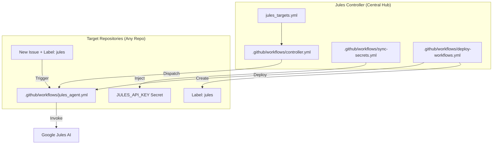

# 🤖 Google Jules Master Controller

Questo repository funge da **Cervello Centrale** per l'orchestrazione di Google Jules su tutti i tuoi repository GitHub. Permette di gestire automazioni cicliche notturne e abilita la programmazione remota tramite Issue (anche da mobile).

---

## 🏗️ Architettura del Sistema

Il sistema è composto da un controller centrale (questo repo) che "inietta" le dipendenze e i comandi necessari nei repository target.



---

## 🚀 Funzionalità Principali

### 1. Automazione Ciclica Programmata (`controller.yml`)

- **Esecuzione:** Ogni notte alle **04:00 AM**.
- **Logica:** Legge il file `jules_targets.yml`, itera sui repository specificati e lancia le automazioni definite (es. scansioni di vulnerabilità, refactoring, update documentazione).
- **Personalizzazione:** Ogni target può avere più automazioni con prompt specifici.

### 2. Sincronizzazione Universale (`sync-secrets.yml` & `deploy-workflows.yml`)

- **Esecuzione:** Ogni notte alle **03:00 AM**.
- **Scope:** Agisce su **tutti i repository** (sia pubblici che **privati**, non archiviati) dell'account `GabryXn`.
- **Azioni:**
  - **Setup Automazione (`sync-secrets.yml`):** Iniezione automatica della `JULES_API_KEY` e creazione della label `jules` (colore viola `715cd7`).
  - **Deployment Workflow (`deploy-workflows.yml`):** Installazione/Aggiornamento del workflow `jules_agent.yml`.
- **Risultato:** Ogni nuovo repository creato diventa automaticamente "Jules-ready" entro 24 ore.

---

## ⚙️ Configurazione Iniziale

Per far funzionare il controller, devono essere impostati i seguenti **Repository Secrets** in questo repository (`jules-controller`):

1. **`PAT_TOKEN`**: Un GitHub Personal Access Token (Fine-grained) con permessi di:
   - `Contents: Read & Write`
   - `Workflows: Read & Write`
   - `Secrets: Read & Write`
   - `Metadata: Read-only`
2. **`JULES_API_KEY`**: La tua chiave API per accedere a Google Jules.

Una volta impostati i secret, i workflow notturni si occuperanno di configurare tutto l'ecosistema GitHub automaticamente. Non è necessario eseguire script locali.

---

### 3. Programmazione via Issue (Remote Access)

Grazie al workflow deployato in ogni repo (pubblico o **privato**), puoi comandare Jules direttamente dalle Issue di GitHub:

1. Crea una Issue in qualsiasi repo.
2. Descrivi cosa vuoi fare (es. "Aggiungi logica di validazione al form di login").
3. Aggiungi la label `jules`.
4. Jules leggerà l'issue e proporrà una Pull Request con le modifiche.

---

## 📂 Struttura del Repository

### `.github/workflows/`

- **`controller.yml`**: Il dispatcher principale per i task pianificati.
- **`sync-secrets.yml`**: Si assicura che ogni repo abbia la chiave API corretta.
- **`deploy-workflows.yml`**: Il "distributore" che installa Jules in tutto il tuo ecosistema GitHub.

### `templates/`

- **`jules_agent.yml`**: Il workflow "operaio" che viene copiato nei repo target. Utilizza l'azione ufficiale `google-labs-code/jules-action@v1.0.0`.

### `jules_targets.yml`

Il file di configurazione per i task ciclici. Contiene:

- Elenco dei repo da monitorare.
- Elenco delle automazioni (nome + prompt dettagliato).
- Un template integrato per aggiungere facilmente nuovi target.

### `jules_config.yml`

Il file di **Controllo Globale** (Centralized Control). Permette di abilitare/disabilitare intere categorie di trigger con un solo flag:

- `cyclic_automation`: Attiva/Disattiva l'esecuzione notturna dei target.
- `issue_automation`: Attiva/Disattiva la risposta di Jules alle Issue etichettate.
- `calendar_automation`: Attiva/Disattiva l'invio di comandi dal calendario.
- `workflow_deployment`: Attiva/Disattiva la sincronizzazione automatica dei repo target.

---

## 📅 4. Automazione tramite Google Calendar (Event-Driven)

Jules può essere innescato puntualmente al minuto creando un evento sul tuo Google Calendar. Per far questo, c'è un progetto **Node.js/TypeScript** nella cartella `calendar-integration`. L'architettura non usa polling fisso, ma un approccio 100% event-driven ottimizzato per non sprecare risorse su Apps Script.

### Come funziona

1. Crei un evento intitolato `Jules: tuo-username/tuo-repo` sul calendario. La descrizione dell'evento diventa il prompt per Jules.
2. Il trigger **OnChange** di Google Calendar nota l'evento e crea un trigger temporale "usa-e-getta" programmato esattamente all'orario di inizio.
3. All'orario stabilito, il trigger si attiva, fa la chiamata API a GitHub, e poi **si autodistrugge**.

### Installazione e Deployment

Avrai bisogno di Node.js e `pnpm` (o `npm`/`yarn`) installati sul tuo PC, e devi aver abilitato l'Accesso alle API di Google Apps Script (in <https://script.google.com/home/usersettings>).

1. **Inizializza il progetto Apps Script vuoto:**
   Crea un nuovo progetto su script.google.com e segnati il suo **Script ID** (si trova in Impostazioni progetto).

2. **Configurazione Clasp Locale:**

   ```bash
   cd calendar-integration
   pnpm install
   pnpm run login  # Fai il login con il tuo account Google
   ```

   Crea un file `.clasp.json` nella cartella `calendar-integration` con questo contenuto (inserisci il tuo Script ID):

   ```json
   {
     "scriptId": "IL_TUO_SCRIPT_ID",
     "rootDir": "dist"
   }
   ```

3. **Compilazione e Deployment:**

   ```bash
   pnpm run deploy
   ```

   *Questo comando compilerà il codice TypeScript tramite `esbuild` nel file `dist/Code.js` e farà il push su Apps Script tramite clasp.*

4. **Configurazione su Apps Script:**
   - Vai sul tuo progetto Apps Script nel browser.
   - Vai su **Impostazioni progetto > Proprietà dello script** e aggiungi una nuova proprietà:
     - Proprietá: `PAT_TOKEN`
     - Valore: `[IL_TUO_GITHUB_PAT_TOKEN]` (con permessi `actions:write`)
   - Seleziona la funzione `setupCalendarTrigger` ed **eseguila una sola volta** manualmente usando il tasto "Esegui" nell'editor di Apps Script. Questo creerà il trigger che si sveglia ai cambiamenti del tuo calendario.

Ora sei pronto! Crea semplicemente un evento su Google Calendar con titolo `Jules: GabryXn/tuo-repo` e metti le istruzioni come descrizione dell'evento.

---

## 🛠️ Risoluzione dei Problemi & Sicurezza

### Log e Debug

Ogni componente è stato progettato per fornire log dettagliati in caso di errore:

- **Controller Locale**: Controlla i log dell'azione "Jules Master Controller" in GitHub Actions. Ti avviserà se un repository non è accessibile o se mancano i permessi nel `PAT_TOKEN`.
- **Agente Target**: Se Jules non parte dopo aver messo la label, controlla la tab "Actions" nel repository target. Vedrai i motivi dell'eventuale skip (es. configurazione globale disattivata).
- **Calendario**: Se la chiamata non arriva a GitHub, controlla le **Esecuzioni** su Google Apps Script per vedere i codici di errore HTTP.

### Sicurezza (Best Practices)

- **Prompt Injection**: Gli input provenienti dalle Issue sono chiaramente delimitati per evitare che Jules interpreti il corpo del testo come comandi di sistema.
- **Minimo Privilegio**: Usa un GitHub PAT con i permessi minimi necessari descritti sopra.
- **Rotazione Segreti**: Si consiglia di ruotare periodicamente la `JULES_API_KEY` e il `PAT_TOKEN`.

---

*Creato con ❤️ per massimizzare la produttività con Google Jules.*
