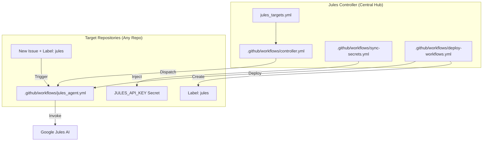

# 🤖 Google Jules Master Controller

Questo repository funge da **Cervello Centrale** per l'orchestrazione di Google Jules su tutti i tuoi repository GitHub. Permette di gestire automazioni cicliche notturne e abilita la programmazione remota tramite Issue (anche da mobile).

---

## 🏗️ Architettura del Sistema

Il sistema è composto da un controller centrale (questo repo) che "inietta" le dipendenze e i comandi necessari nei repository target.

---

## 🚀 Funzionalità Principali

### 1. Automazione Ciclica Programmata (`controller.yml`)
- **Esecuzione:** Ogni notte alle **04:00 AM**.
- **Logica:** Legge il file `jules_targets.yml`, itera sui repository specificati e lancia le automazioni definite (es. scansioni di vulnerabilità, refactoring, update documentazione).
- **Personalizzazione:** Ogni target può avere più automazioni con prompt specifici.

### 2. Sincronizzazione Universale (`sync-secrets.yml` & `deploy-workflows.yml`)
- **Esecuzione:** Ogni notte alle **03:00 AM**.
- **Scope:** Agisce su **tutti i repository** (non archiviati) dell'account `GabryXn`.
- **Azioni:**
    - Iniezione automatica della `JULES_API_KEY`.
    - Deployment/Aggiornamento del workflow `jules_agent.yml`.
    - Creazione automatica della label `jules` (colore viola `715cd7`).
- **Risultato:** Ogni nuovo repository creato diventa automaticamente "Jules-ready" entro 24 ore.

### 3. Programmazione via Issue (Remote Access)
Grazie al workflow deployato in ogni repo, puoi comandare Jules direttamente dalle Issue di GitHub:
1. Crea una Issue in qualsiasi repo.
2. Descrivi cosa vuoi fare (es. "Aggiungi logica di validazione al form di login").
3. Aggiungi la label `jules`.
4. Jules leggerà l'issue e proporrà una Pull Request con le modifiche.

---

## 📂 Struttura del Repository

### `.github/workflows/`
- **`controller.yml`**: Il dispatcher principale per i task pianificati.
- **`sync-secrets.yml`**: Si assicura che ogni repo abbia la chiave API corretta.
- **`deploy-workflows.yml`**: Il "distributore" che installa Jules in tutto il tuo ecosistema GitHub.

### `templates/`
- **`jules_agent.yml`**: Il workflow "operaio" che viene copiato nei repo target. Utilizza l'azione ufficiale `google-labs-code/jules-invoke@v1`.

### `jules_targets.yml`
Il file di configurazione per i task ciclici. Contiene:
- Elenco dei repo da monitorare.
- Elenco delle automazioni (nome + prompt dettagliato).
- Un template integrato per aggiungere facilmente nuovi target.

### Script di Utility
- **`create-labels.ps1`**: Script PowerShell per il bootstrap iniziale delle label su tutti i repo (eseguito localmente).
- **`create-labels.sh`**: Equivalente Bash per sistemi Linux/WSL.

---

## ⚙️ Configurazione Iniziale

Per far funzionare il controller, devono essere impostati i seguenti **Repository Secrets** in questo repository (`jules-controller`):

1. **`PAT_TOKEN`**: Un GitHub Personal Access Token (Fine-grained) con permessi di:
   - `Contents: Read & Write`
   - `Workflows: Read & Write`
   - `Secrets: Read & Write`
   - `Metadata: Read-only`
2. **`JULES_API_KEY`**: La tua chiave API per accedere a Google Jules.

---

## 📝 Come aggiungere un nuovo target ciclico

1. Apri `jules_targets.yml`.
2. Copia il blocco dal `TEMPLATE_FOR_COPY_PASTE`.
3. Inserisci il nome del repository e il prompt desiderato.
4. Salva e pusha. Il controller lo prenderà in carico alla prossima esecuzione notturna.

---

*Creato con ❤️ per massimizzare la produttività con Google Jules.*
