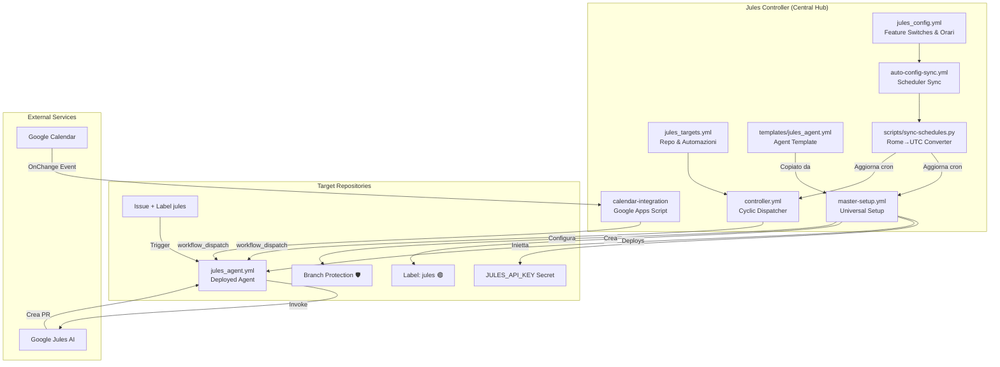

# 🤖 Google Jules Master Controller

[](../LICENSE)

> **Il Cervello Centrale** per l'orchestrazione di Google Jules su tutti i tuoi repository GitHub.
> Permette di gestire automazioni cicliche notturne, programmazione remota tramite Issue, comandi da Google Calendar e protezione automatica dei branch — tutto da un unico punto di controllo.

---

## 📋 Indice

- [Architettura del Sistema](#-architettura-del-sistema)
- [Funzionalità](#-funzionalità)
  - [1. Automazione Ciclica Programmata](#1-automazione-ciclica-programmata-controlleryml)
  - [2. Sincronizzazione Universale](#2-sincronizzazione-universale-master-setupyml)
  - [3. Programmazione via Issue](#3-programmazione-via-issue-remote-access)
  - [4. Automazione via Google Calendar](#4-automazione-via-google-calendar-event-driven)
  - [5. Controllo Centralizzato](#5-controllo-centralizzato-jules_configyml)
  - [6. Auto-Sync degli Orari](#6-auto-sync-degli-orari-auto-config-syncyml)
  - [7. Branch Protection Automatica](#7-branch-protection-automatica)
  - [8. Deploy Universale Clasp](#8-deploy-universale-clasp-clasp_deployyml)
  - [9. Prompt Library](#9-prompt-library-promptsmd)
- [Configurazione Iniziale](#-configurazione-iniziale)
- [Struttura del Repository](#-struttura-del-repository)
- [Installazione Calendar Integration](#-installazione-calendar-integration)
- [Risoluzione dei Problemi](#-risoluzione-dei-problemi--sicurezza)

---

## 🏗️ Architettura del Sistema

Il sistema è composto da un controller centrale (questo repo) che "inietta" dipendenze, workflow, segreti e protezioni nei repository target. Ogni componente opera in modo indipendente ma coordinato.



---

## 🚀 Funzionalità

### 1. Automazione Ciclica Programmata (`controller.yml`)

Il cuore del sistema: esegue automaticamente i task definiti in `jules_targets.yml` su tutti i repository target.

| Proprietà | Dettaglio |
| :--- | :--- |
| **Esecuzione** | Ogni notte alle **04:00 AM (Rome Time)** |
| **Trigger Manuale** | Sì, tramite `workflow_dispatch` dalla tab Actions |
| **Logica** | Legge `jules_targets.yml`, itera sui repository e lancia ogni automazione definita |

**Caratteristiche di Robustezza:**

- ✅ **Validazione Token**: Controlla la validità di `PAT_TOKEN` e `JULES_API_KEY` prima di iniziare.
- ✅ **Check Centralizzato**: Verifica che `cyclic_automation` sia abilitato in `jules_config.yml`.
- ✅ **Error Reporting**: In caso di fallimento del dispatch, fornisce suggerimenti di debug contestuali (es. "workflow non trovato", "permessi mancanti").

---

### 2. Sincronizzazione Universale (`master-setup.yml`)

Il workflow che garantisce che **ogni repository** dell'account sia sempre allineato con la configurazione centrale.

| Proprietà | Dettaglio |
| :--- | :--- |
| **Esecuzione** | Ogni notte alle **03:00 AM (Rome Time)**, prima del controller |
| **Scope** | Tutti i repository non-archiviati dell'account configurato via `PAT_TOKEN` |
| **Trigger Manuale** | Sì, tramite `workflow_dispatch` |

**Azioni Sequenziali (per ogni repository):**

1. 🔑 **Iniezione `JULES_API_KEY`**: Sincronizza il segreto API su ogni repo target.
2. 📄 **Deployment `jules_agent.yml`**: Copia l'ultima versione del template agent nel percorso `.github/workflows/`.
3. 🏷️ **Creazione Label `jules`**: Crea (o verifica l'esistenza) della label viola (`#715cd7`) per il trigger via Issue.
4. 🛡️ **Branch Protection**: Configura automaticamente la protezione del branch di default (vedi [sezione dedicata](#7-branch-protection-automatica)).
5. 🧹 **Auto-delete Branches**: Abilita l'eliminazione automatica dei branch una volta mergiati.

**Vantaggio**: L'esecuzione sequenziale garantisce che i segreti siano pronti prima del deployment dei workflow, eliminando ogni rischio di race condition.

---

### 3. Programmazione via Issue (Remote Access)

Grazie al workflow `jules_agent.yml` deployato in ogni repo (pubblico o **privato**), puoi comandare Jules direttamente dal telefono o dal browser:

1. Vai su un qualsiasi repository target.
2. Crea una nuova **Issue**.
3. Scrivi nel titolo e nel corpo cosa vuoi che Jules faccia (es. "Aggiungi logica di validazione al form di login").
4. Aggiungi la label **`jules`** 🟣.
5. Jules leggerà automaticamente l'Issue e creerà una **Pull Request** con le modifiche proposte.

**Dettagli Tecnici:**

- Il prompt inviato a Jules include il numero, il titolo e il corpo dell'Issue, formattati con delimitatori chiari (`--- USER REQUEST START/END ---`).
- La feature può essere disattivata centralmente impostando `issue_automation: false` in `jules_config.yml`.

---

### 4. Automazione via Google Calendar (Event-Driven)

Jules può essere innescato **al minuto esatto** creando un evento sul tuo Google Calendar. L'architettura è 100% event-driven e non usa polling fisso.

#### Come Funziona

1. **Crei un evento** nel tuo calendario con il titolo: `Jules: tuo-username/tuo-repo`.
2. Nella **descrizione** dell'evento scrivi il prompt (le istruzioni per Jules).
3. Il trigger **OnChange** di Google Calendar rileva l'evento e crea un trigger temporale "usa-e-getta" programmato esattamente all'orario di inizio.
4. All'orario stabilito, il trigger si attiva, invia la richiesta di `workflow_dispatch` a GitHub, e poi **si autodistrugge**.

#### Caratteristiche Avanzate

| Feature | Dettaglio |
| :--- | :--- |
| **Regex Flessibile** | Il titolo è case-insensitive: `Jules: user/repo`, `jules : user/repo` sono tutti validi |
| **Rilevamento Branch** | Lo script rileva automaticamente il branch di default del repo (`main` o `master`) |
| **Sanificazione Prompt** | I tag HTML e le entità speciali (es. `<code>`, `&nbsp;`) vengono rimossi automaticamente dalla descrizione dell'evento |
| **Protezione da Duplicati** | `LockService` impedisce esecuzioni parallele. Un checksum per ogni evento garantisce che al massimo un solo trigger sia attivo per evento |
| **Cleanup Chirurgico** | Ogni trigger è tracciato con un ID univoco (`triggerId`). Quando un evento viene modificato o cancellato, viene rimosso solo il trigger specifico associato |
| **Finestra Temporale** | Il sistema cerca eventi in una finestra di ±2 minuti rispetto all'orario corrente |
| **Retry con Backoff** | In caso di errori server (5xx), lo script riprova fino a 3 volte con un intervallo di 5 secondi |
| **Controllo Centralizzato** | Rispetta il flag `calendar_automation` in `jules_config.yml`. Lo recupera tramite API autenticata (supporto repo privati) |

---

### 5. Controllo Centralizzato (`jules_config.yml`)

Un unico file YAML per governare l'intero ecosistema. Modificando un singolo flag, puoi accendere o spegnere intere categorie di trigger senza toccare altro codice.

```yaml
features:
  cyclic_automation: true     # Attiva/Disattiva l'esecuzione notturna
  issue_automation: true      # Attiva/Disattiva la risposta alle Issue
  calendar_automation: true   # Attiva/Disattiva i trigger da calendario
  workflow_deployment: true   # Attiva/Disattiva la sincronizzazione dei repo

schedules:
  setup_sync_time: "03:00"           # Orario del Setup Universale (Rome Time)
  master_controller_time: "04:00"    # Orario del Controller Ciclico (Rome Time)
```

**Come viene usato:**

- Il flag `cyclic_automation` viene letto da `controller.yml` prima di lanciare le automazioni.
- Il flag `issue_automation` viene letto dal `jules_agent.yml` deployato in ogni repo target (fetch remoto via `curl`).
- Il flag `calendar_automation` viene letto dallo script Apps Script prima di ogni dispatch.
- Il flag `workflow_deployment` viene letto da `master-setup.yml` prima di distribuire i workflow.

---

### 6. Auto-Sync degli Orari (`auto-config-sync.yml`)

Ogni volta che modifichi gli orari nella sezione `schedules` di `jules_config.yml` e fai push, questo workflow si attiva automaticamente e aggiorna le espressioni `cron` nei file workflow.

**Flusso:**

1. Rileva il push su `jules_config.yml`.
2. Esegue `scripts/sync-schedules.py`, che legge gli orari in formato **Rome Time** e li converte in **UTC** (offset CET = UTC+1).
3. Aggiorna le righe `cron` nei file `master-setup.yml` e `controller.yml` tramite regex.
4. Committa e pusha automaticamente i cambiamenti.

**Esempio:** Cambi `setup_sync_time` da `"03:00"` a `"05:00"` → Il cron in `master-setup.yml` diventa automaticamente `0 4 * * *` (UTC).

---

### 7. Branch Protection Automatica

Il workflow `master-setup.yml` configura automaticamente la protezione del branch di default su ogni repository target. Questo garantisce che:

- ❌ **Nessun push diretto** sul branch principale (neanche da Jules o da bot).
- ❌ **Nessun force push** consentito.
- ❌ **Nessuna cancellazione** del branch principale.
- ✅ **Tutte le modifiche passano tramite Pull Request**, richiedendo il merge manuale da parte dell'utente.
- ✅ **Enforce Admins**: La protezione si applica anche agli amministratori del repository.
- ✅ **Auto-delete Branch**: Rimuove automaticamente i branch head dopo il merge delle Pull Request.

**Nota**: La protezione viene applicata ad ogni esecuzione del Setup Universale, garantendo che nuovi repository vengano protetti automaticamente.

---

### 8. Deploy Universale Clasp (`clasp_deploy.yml`)

Per i repository che utilizzano Google Apps Script con TypeScript e Vite/Esbuild, Jules Controller automatizza il build e il push su Apps Script ogni volta che viene fatto un merge sul branch principale.

#### Come Funziona

1. Il Setup Universale rileva la presenza di un file `.clasp.json` nella root del repository target.
2. Inietta il workflow `clasp_deploy.yml` che gestisce l'installazione delle dipendenze (npm/pnpm/yarn), il build e il push.
3. Sincronizza il segreto `CLASPRC_JSON` per permettere l'autenticazione headless.

#### Configurazione Credenziali

Per abilitare il deploy automatico, devi fornire le tue credenziali Clasp al Controller:

1. Trova il file delle credenziali sul tuo computer (solitamente `~/.clasprc.json`).
2. Copia l'intero contenuto JSON.
3. Vai nei **Settings → Secrets → Actions** di questo repository (`jules-controller`).
4. Aggiungi un nuovo secret chiamato **`CLASPRC_JSON`** e incolla il contenuto.

Il Setup Universale si occuperà di distribuire questa chiave in modo sicuro a tutti i repository Clasp rilevati.

---

### 9. Prompt Library (`PROMPTS.md`)

Una collezione di prompt pre-ottimizzati e testati per le automazioni più comuni. Disponibile nel file `PROMPTS.md` alla radice del repository.

**Categorie disponibili:**

- 🔍 **Bug Hunt & Cleanup**: Revisione qualità, pulizia codice morto, standardizzazione e documentazione.
- 🛡️ **Security Audit**: Ricerca vulnerabilità, controllo dipendenze, validazione input.
- ✍️ **Documentation Refresher**: Aggiornamento README, commenti e JSDoc.

I prompt sono strutturati con ruoli (es. "Senior Software Engineer"), compiti atomici numerati e vincoli di sicurezza per guidare Jules verso risultati precisi senza rischi.

---

## ⚙️ Configurazione Iniziale

### Prerequisiti

| Requisito | Dettaglio |
| :--- | :--- |
| **GitHub PAT** (Fine-grained) | Con permessi: `Contents: R/W`, `Workflows: R/W`, `Secrets: R/W`, `Metadata: Read`, `Administration: R/W` |
| **Jules API Key** | Ottenibile dalla dashboard di Google Jules |
| **Node.js + pnpm** | Solo se si vuole usare la Calendar Integration |

### Setup

1. Vai su **Settings → Secrets → Actions** di questo repository.
2. Aggiungi i seguenti **Repository Secrets**:

   | Secret | Descrizione |
   | :--- | :--- |
   | `PAT_TOKEN` | Il tuo GitHub Personal Access Token |
   | `JULES_API_KEY` | La tua chiave API di Google Jules |

3. Lancia manualmente il workflow **"Jules Universal Setup (Secrets & Workflows)"** dalla tab Actions per configurare tutti i repository al primo avvio.

Una volta completato, i workflow notturni si occuperanno di mantenere tutto sincronizzato automaticamente.

---

## 📂 Struttura del Repository

```text
jules-controller/
├── .github/workflows/
│   ├── controller.yml          # Dispatcher ciclico notturno
│   ├── master-setup.yml        # Setup universale (secrets, workflow, label, branch protection)
│   └── auto-config-sync.yml    # Auto-sync orari Rome→UTC
├── calendar-integration/
│   ├── src/
│   │   └── index.ts            # Logica completa: API GitHub, Calendar, Trigger Management
│   ├── dist/                   # Output compilato per Apps Script
│   ├── scripts/
│   │   └── build.js            # Build script (esbuild → Code.js)
│   ├── package.json            # Dipendenze: esbuild, @types/google-apps-script
│   └── .clasp.json             # Configurazione Clasp (Script ID)
├── scripts/
│   └── sync-schedules.py       # Convertitore Rome Time → UTC cron
├── templates/
│   └── jules_agent.yml         # Template agent copiato in ogni repo target
├── jules_config.yml            # Controllo centralizzato (Feature Switches & Orari)
├── jules_targets.yml           # Definizione repo target e automazioni cicliche
├── PROMPTS.md                  # Libreria di prompt ottimizzati per Jules
├── .gitignore                  # Esclusioni (node_modules, dist, .clasp.json, ecc.)
└── README.md                   # Questa documentazione
```

---

## 📅 Installazione Calendar Integration

> Questa sezione è necessaria solo se vuoi utilizzare la funzionalità di trigger via Google Calendar.

### Prerequisiti

- **Node.js** (≥18) e **pnpm** installati.
- **API Google Apps Script** abilitate su [script.google.com/home/usersettings](https://script.google.com/home/usersettings).
- **clasp** installato globalmente (`npm install -g @google/clasp`).

### Passi

1. **Crea un progetto Apps Script vuoto** su [script.google.com](https://script.google.com) e copia il suo **Script ID** (Impostazioni progetto).

2. **Configura il progetto locale:**

   ```bash
   cd calendar-integration
   pnpm install
   pnpm run login  # Login con il tuo account Google
   ```

   Crea il file `.clasp.json` nella cartella `calendar-integration`:

   ```json
   {
     "scriptId": "IL_TUO_SCRIPT_ID",
     "rootDir": "dist"
   }
   ```

3. **Compila e deploya:**

   ```bash
   pnpm run deploy
   ```

   Questo comando:
   - Compila `src/index.ts` → `dist/Code.js` tramite **esbuild** (banner + bundle).
   - Esegue `clasp push` per caricare il codice su Apps Script.

4. **Configura Apps Script nel browser:**
   - Vai su **Impostazioni progetto → Proprietà dello script**.
   - Aggiungi la proprietà: `PAT_TOKEN` = `[IL TUO GITHUB PAT TOKEN]`.
   - Esegui la funzione `setupCalendarTrigger` **una sola volta** manualmente (tasto "Esegui" nell'editor).

5. **Testa:** Crea un evento nel calendario con titolo `Jules: your-username/your-repo` e le istruzioni nella descrizione.

---

## 🛠️ Risoluzione dei Problemi & Sicurezza

### Tabella dei Codici di Errore

| Errore | Causa Probabile | Soluzione |
| :--- | :--- | :--- |
| `PAT_TOKEN is invalid` | Token scaduto o revocato | Rigenera il Fine-grained PAT su GitHub e aggiorna il Secret |
| `404 Not Found` | Mancanza permessi repo | Assicurati che il PAT abbia accesso ai repository target |
| `Could not find workflow` | Setup non completato | Lancia manualmente `master-setup.yml` dalla tab Actions |
| `JULES_API_KEY missing` | Secret non impostato | Aggiungi `JULES_API_KEY` ai Secret del repository controller |
| `Could not apply branch protection` | PAT senza permessi admin | Aggiungi il permesso `Administration: Read/Write` al PAT |
| `Could not fetch global config` | Repo controller privato / PAT scaduto | Verifica che il PAT abbia accesso al repo `jules-controller` |
| `Calendar: Lock timeout` | Troppe modifiche rapide al calendario | Attendi 30 secondi e riprova. Il LockService si sbloccherà automaticamente |

### Sicurezza (Best Practices)

| Misura | Dettaglio |
| :--- | :--- |
| **Prompt Injection** | Gli input dalle Issue sono delimitati con `--- USER REQUEST START/END ---` per impedire che Jules interpreti il corpo come comandi di sistema |
| **Branch Protection** | Attivata automaticamente su ogni repo. Impedisce push diretti e richiede PR per ogni modifica |
| **No Auto-Merge** | Il template include la direttiva esplicita: "NON EFFETTUARE MAI IL MERGE". Jules crea solo PR |
| **Sanificazione HTML** | I prompt dal calendario vengono puliti da tag HTML e entità speciali prima dell'invio |
| **Minimo Privilegio** | Usa un GitHub PAT con i permessi minimi necessari |
| **Rotazione Segreti** | Si consiglia di ruotare periodicamente `JULES_API_KEY` e `PAT_TOKEN` |
| **Lock Concorrenza** | La Calendar Integration usa `LockService` per impedire esecuzioni parallele |

---

*Creato con ❤️ per massimizzare la produttività con Google Jules.*
